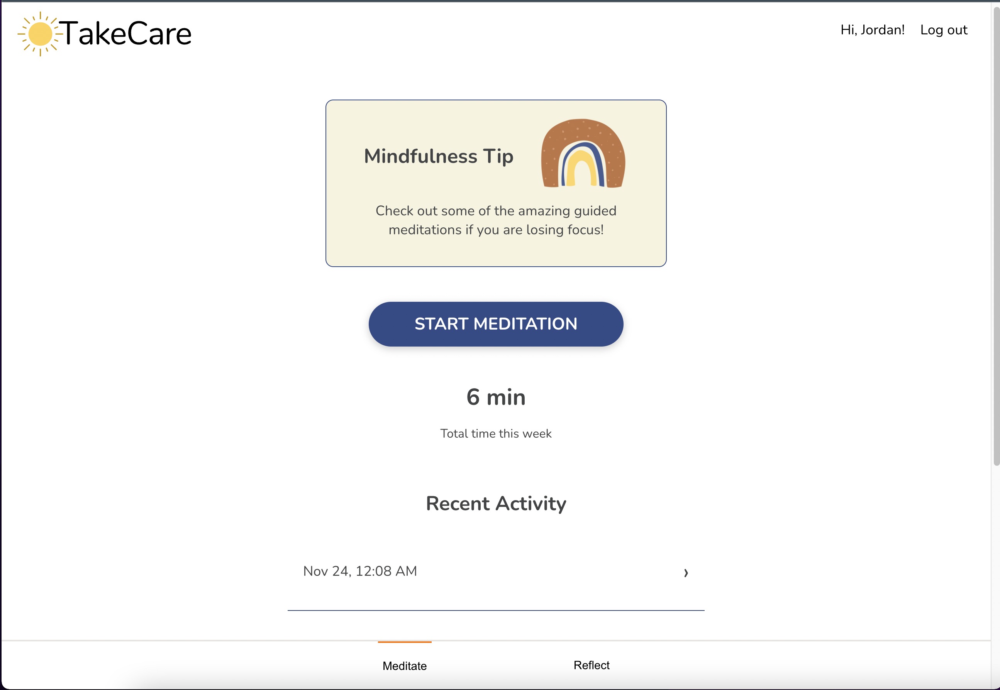
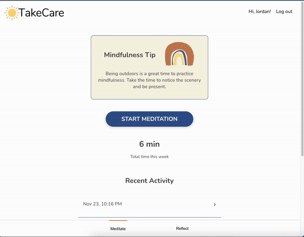
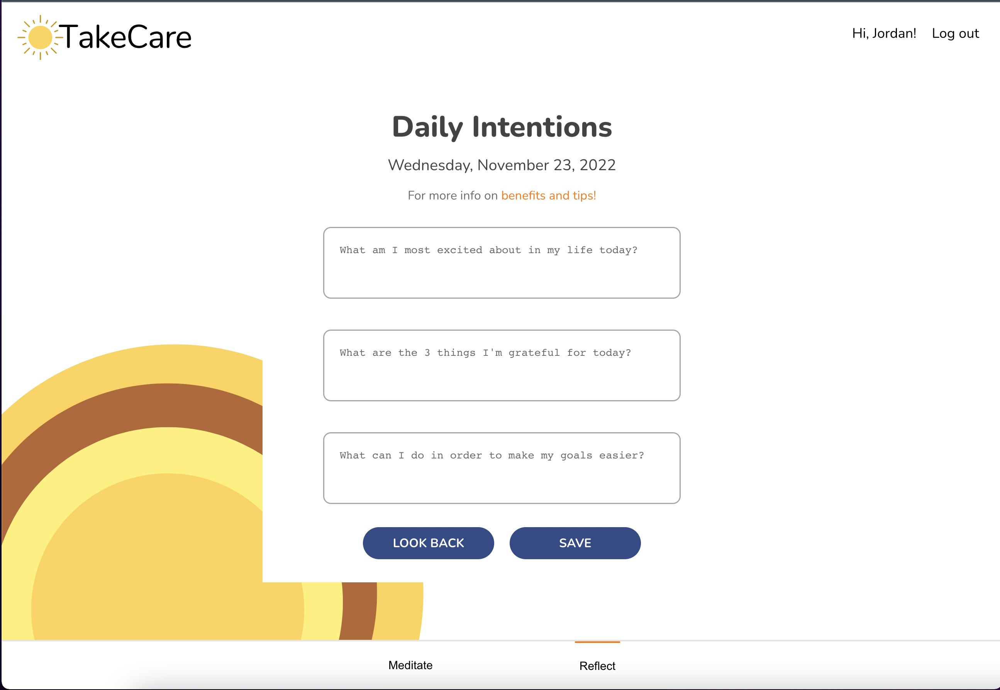

# Take Care
Flatiron Capstone Project

 

## Overview

Take Care in a minfulness app for meditations and daily intentions!
 
 

 
 

## What It Does
After a user logs in they can choose to meditate or create a daily intention entry. Within their daily intentions page they look back on previous intentions or create a new one for the day.
Users also have the option to meditate. Within a meditation, there a number of soundscapes to choose from before starting a 20 second guided breathing exorcise. After the meditation is completed, the user will be taken to a meditation reflection page. Recent meditation activity can be viewed from the homepage.
 
 

 
 

## How It Functions
The API is built using Ruby on Rails. The database is using Postgres so store and manipulate a variety tables. The frontend uses a variety of fetch requests to handle the data from the APi. 
 

 

## Deployed Project
This project is deployed using Render. 
 
To checkout this live version go to: https://take-care.onrender.com/
 
Feel free to use email: test@gmail.com, password: 12341234

 

Hope you enjoy!

 

