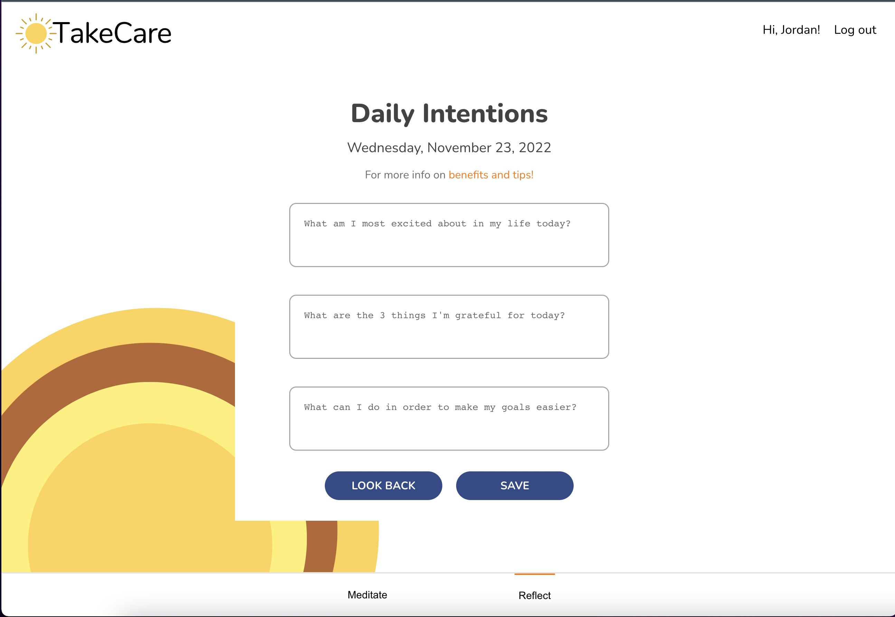

# Green Room

</br>
Flatiron Capstone Project
</br>
</br>


## Overview
Take Care in a minfulness app for meditations and daily intentions. 
</br>
</br>


## What It Does
After a user logs in they can choose to meditate or create a daily intention entry. Within their daily intentions page they look back on previous intentions or create a new one for the day.
Users also have the option to meditate. Within a meditation, there a number of soundscapes to choose from before starting a 20 second guided breathing exorcise. After the meditation is completed, the user will be taken to a meditation reflection page. Recent meditation activity can be viewed from the homepage.
</br>
</br>


</br>
</br>

## How It Functions
The main functionality is built using fetch requests to our backend server to handle all CRUD capabilities. The three tables being interacted with by the frontend are Rooms, Plants, and Added_Plants. These three tables represent a many-to-many relationship in our database. The database and routes are being handle by Active Records, Rake, and Sinatra. 
</br>
</br>

## How to Run the Project
The app requires you to install dependencies and run a local server. Read directions on how to get the backend started at: https://github.com/jordanje/green-room-backend. Fork and download both repositories to your computer to get the site fully functioning.

```
$ npm install 
$ npm start
```

</br>
